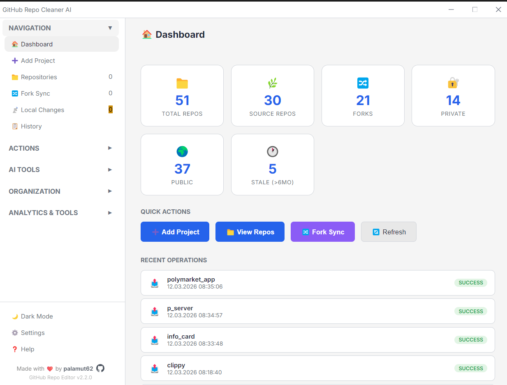

# GitHub Repo Manager & Cleaner 🧹

A powerful Electron desktop application designed to help you manage, clean up, and intelligently rename your GitHub repositories using AI.



## 🚀 Features

*   **Repository Listing:** View all your GitHub repositories (distinguishing between Source and Fork).
*   **Filtering & Sorting:** Filter by Source/Fork and sort by update date.
*   **Bulk Deletion:** Select multiple repositories and delete them in bulk with a single click.
*   **🤖 AI Smart Rename:**
    *   **OpenRouter (Moonshot AI)** integration.
    *   Analyzes repository `README.md` content.
    *   Suggests the most appropriate name based on the content.
    *   Side-by-side comparison of Old vs. New names.
    *   One-click automatic renaming.
*   **Secure Credential Management:** Stores your GitHub Token and OpenRouter API keys locally (`.env`).

## 🛠️ Installation

1.  Clone this repository to your local machine.
2.  Install the required dependencies:
    ```bash
    npm install
    ```

## ▶️ Usage

To start the application:

```bash
npm start
```

### Settings
When the application starts, click the **⚙️ Settings** button in the top right corner:
1.  **GitHub Token:** Enter a Personal Access Token with `repo` and `delete_repo` scopes.
2.  **OpenRouter API Key:** Enter your API key required for AI features.

Save your credentials to proceed.

## ⚠️ Important Warnings

*   **Deleting Repositories:** Deleted repositories **cannot** be restored. Proceed with caution.
*   **Renaming Repositories:** Renaming a repository changes its **Remote URL**. You may need to update the remote URL in your local projects using `git remote set-url`.

## 💻 Technologies

*   Electron.js
*   Node.js
*   OpenRouter API (Moonshot AI)
*   GitHub API

---
*Developer: Umut*