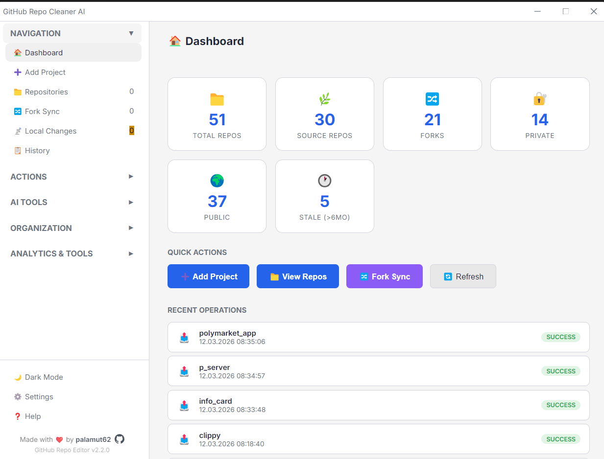

# GitHub Repo Manager & Cleaner

A powerful Electron desktop application designed to help you manage, clean up, and intelligently organize your GitHub repositories using AI.



## Features

### Core Features
- **Repository Listing:** View all your GitHub repositories with Source/Fork distinction
- **Filtering & Sorting:** Filter by Source/Fork and sort by update date
- **Search:** Quick search to find repositories by name
- **Dual View Modes:** Switch between List and Grid views
- **License Status Display:** Instantly see if a repo has an MIT license, another license, or no license
- **Bulk Selection:** Select all repositories on the current page with a single click
- **Bulk Deletion:** Select and delete multiple repositories at once

### Add Project & Publish
Publish local folders to GitHub directly from the app with a single click:

- **Folder Selection:** Pick one or multiple local folders at once
- **Auto Git Init:** Automatically initializes a git repo if one doesn't exist
- **Visibility Control:** Set each repo as Public or Private individually
- **Live Progress:** Per-repo status updates during the create & push process

#### Auto .gitignore Generation
Automatically generates an appropriate `.gitignore` for each project before the initial commit:

| Detected Type | Detection Method |
|---|---|
| Node.js | `package.json` |
| React / Next.js | `package.json` + React dependency |
| Vue / Nuxt | `package.json` + Vue dependency |
| Angular | `package.json` + Angular dependency |
| Svelte | `package.json` + Svelte dependency |
| Electron | `package.json` + Electron dependency |
| Python | `requirements.txt`, `setup.py`, `pyproject.toml` |
| Java (Maven/Gradle) | `pom.xml`, `build.gradle` |
| Go | `go.mod` |
| Rust | `Cargo.toml` |
| Ruby | `Gemfile` |
| PHP | `composer.json` |
| C / C++ | `CMakeLists.txt`, `.c`/`.h` files |
| Swift / Xcode | `.xcodeproj`, `.xcworkspace` |
| Unity | `.unity`, `ProjectSettings/` |
| Generic | Fallback for all other projects |

- Detected type is shown under the checkbox in the table
- Can be toggled per folder with the `.gitignore` checkbox
- Skipped automatically if a `.gitignore` already exists
- Runs before `git add` so ignored files are never staged

#### Commit Message Templates
Choose a commit message style that applies to all new repos, with per-row manual override:

| Template | Example Output |
|---|---|
| Simple | `Initial commit` |
| Conventional Commits | `feat: initial project setup` |
| Scoped | `feat(my-project): initial setup` |
| Custom | Any message — use `{{project_name}}` as a placeholder |

- Template selector shown in the Add Project toolbar with a live preview
- Changing the template or repo name auto-updates all rows
- Each row can still be edited individually
- Saved as the default via **Settings → Publish Defaults**

### AI-Powered Features (Requires OpenRouter API Key)
- **AI Smart Rename:** Analyzes README.md content and suggests appropriate repository names
- **AI Description Generator:** Creates professional descriptions based on README content
- **AI README Creator:** Generates complete README.md files by analyzing repository structure
- **AI Commit Fixer:**
  - Analyzes recent commit messages and suggests professional improvements (Conventional Commits)
  - **Apply Fix:** Rewrites history to update a single commit message
  - **Bulk Apply:** Optimally applies all suggestions in one go
  - *Warning:* These features perform a force push operation

### Organization Tools
- **Visibility Control:** Change repositories between Public and Private
- **Topics Manager:** Add or remove topics for better discoverability
- **License Manager:** Add MIT, Apache 2.0, GPL-3.0, or ISC license files
- **Setup/Clone Info:** Quick access to clone URLs (HTTPS & SSH) with one-click copy

### Repository Analysis
- **Stale Repos:** Identify repositories not updated in 6+ months
- **Large Repos:** Find repositories over 50MB
- **Unchanged Forks:** Detect forks without modifications
- **No Stars Repos:** List repositories without any stars

### Fork Management
- **Sync Status:** See if your fork is behind the upstream repository
- **One-Click Sync:** Update your fork with latest changes from parent repository
- **Parent Info:** Quick access to parent repository details

### Repository Details
- Double-click any repository to see detailed information:
  - Stats (Stars, Forks, Watchers, Issues)
  - Language breakdown with percentages
  - Recent commits
  - Clone URLs with copy buttons
  - Quick setup commands

## Installation

1. Clone this repository:
   ```bash
   git clone https://github.com/yourusername/github-repo-manager.git
   cd github-repo-manager
   ```

2. Install dependencies:
   ```bash
   npm install
   ```

## Usage

Start the application:
```bash
npm start
```

### Initial Setup
1. Click **Settings** in the sidebar
2. Enter your **GitHub Token** (requires `repo` and `delete_repo` scopes)
3. Enter your **OpenRouter API Key** for AI features
4. Configure **Publish Defaults** (visibility, branch, auto-.gitignore, commit template)
5. Click **Save Settings**

### Getting a GitHub Token
1. Go to GitHub Settings > Developer settings > Personal access tokens
2. Generate a new token with `repo` and `delete_repo` scopes
3. Copy and paste the token into the app

### Getting an OpenRouter API Key
1. Visit [OpenRouter](https://openrouter.ai/)
2. Create an account and generate an API key
3. Copy and paste the key into the app

### Publishing a Local Project
1. Go to **Add Project** in the sidebar
2. Click **Select Folder** (or **Select Multiple** for batch)
3. The app auto-detects the project type and pre-fills the `.gitignore` checkbox
4. Choose a commit message template from the toolbar
5. Adjust repo names, visibility, descriptions, and commit messages as needed
6. Click **Create & Push**

## Settings

| Setting | Description |
|---|---|
| GitHub Token | Personal access token for GitHub API access |
| OpenRouter Key | API key for AI-powered features |
| Default Visibility | `public` or `private` for new repos |
| Default Branch | `main` or `master` |
| Auto .gitignore | Pre-check the .gitignore checkbox for new folders |
| Commit Template | Default commit message style for new repos |

## Warnings

- **Deleting Repositories:** Deleted repositories **cannot** be restored. Use with caution.
- **Renaming Repositories:** Changes the remote URL. Update local projects with:
  ```bash
  git remote set-url origin NEW_URL
  ```
- **Visibility Changes:** Making repos private may require a paid GitHub plan.
- **AI Commit Fixer:** Rewrites git history and force-pushes. Use only on repos where this is acceptable.

## Technologies

- Electron.js
- Node.js
- OpenRouter API (Moonshot AI / Kimi K2.5)
- GitHub REST API

## Keyboard Shortcuts

- **Ctrl/Cmd + F:** Focus search
- **Esc:** Close modals

---
*Developer: Umut*
